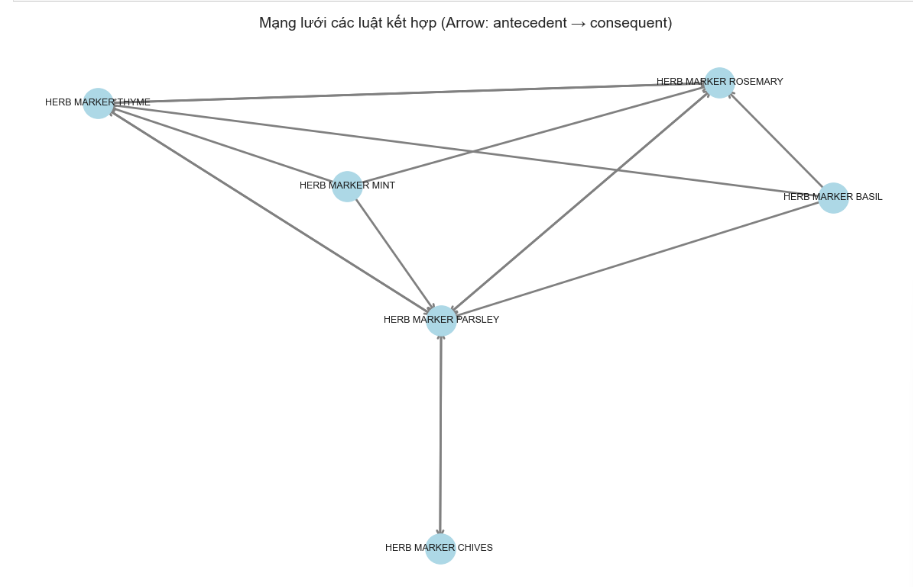
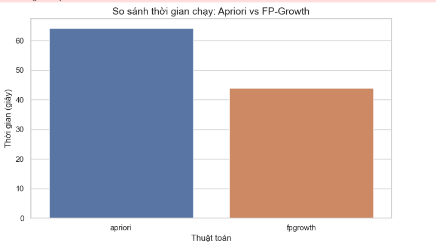

# BÁO CÁO LAB 2: PHÂN TÍCH GIỎ HÀNG VỚI THUẬT TOÁN FP-GROWTH

**Môn học:** Khai phá dữ liệu (Data Mining)  
**Nhóm thực hiện:** Nhóm 2  
**Dataset:** Online Retail (UCI Machine Learning Repository)  
**Mục tiêu:** Khai phá luật kết hợp mua sắm bằng thuật toán FP-Growth và so sánh hiệu năng với Apriori trên tập dữ liệu lớn.

---

## PHẦN 1: CẤU TRÚC DỰ ÁN & TIỀN XỬ LÝ DỮ LIỆU (QUESTION 1)

### 1.1. Cấu trúc dự án (Modular Design)
Khác với cách viết code rời rạc, nhóm đã tổ chức dự án theo mô hình hướng đối tượng (OOP) để dễ dàng tái sử dụng và so sánh:
* **`DataCleaner`**: Module làm sạch dữ liệu, lọc bỏ các giao dịch bị hủy (Invoice bắt đầu bằng 'C') và lọc dữ liệu thị trường UK.
* **`BasketPreparer`**: Chuyển đổi dữ liệu giao dịch sang dạng ma trận nhị phân (One-hot encoding) để phục vụ thuật toán.
* **`FPGrowthMiner`**: Module thực thi thuật toán FP-Growth, được thiết kế interface tương tự `AprioriMiner` để dễ dàng thay thế.

### 1.2. Kết quả tiền xử lý
* **Dữ liệu thô:** Bao gồm hơn 500,000 dòng giao dịch bán lẻ.
* **Sau làm sạch:** Chỉ giữ lại các giao dịch hợp lệ tại UK.
* **Dữ liệu Basket:** Đã chuyển thành công sang file `basket_bool.parquet` để tối ưu tốc độ đọc ghi.

---

## PHẦN 2: MÔ HÌNH HÓA VỚI FP-GROWTH (QUESTION 1 - TIẾP)

### 2.1. Triển khai thuật toán
* Nhóm sử dụng cấu trúc cây **FP-Tree** để nén dữ liệu, giúp giảm thiểu số lần quét cơ sở dữ liệu xuống còn đúng 2 lần.
* **Tham số:** `min_support = 0.01` (1%), `metric = "lift"`, `min_threshold = 1.0`.

### 2.2. Kết quả luật kết hợp (Top Rules)
Dưới đây là một số luật tiêu biểu tìm được:

| Antecedents (Mua) | Consequents (Mua kèm) | Lift (Độ nâng) | Nhận xét |
| :--- | :--- | :--- | :--- |
| **Pink Regency Teacup** | **Green Regency Teacup** | **> 15.0** | Hai sản phẩm này gần như luôn được mua cùng nhau (bộ sưu tập). |
| **Alarm Clock Bakelike Green** | **Alarm Clock Bakelike Red** | **> 12.0** | Khách hàng có xu hướng mua trọn bộ nhiều màu. |

  

---

## PHẦN 3: SO SÁNH HIỆU NĂNG APRIORI VS FP-GROWTH (QUESTION 2)

### 3.1. Thiết lập thí nghiệm (Benchmark)
Nhóm đã chạy thử nghiệm cả hai thuật toán trên cùng một tập dữ liệu với mức độ hỗ trợ (`min_support`) giảm dần từ 5% xuống 1%.

### 3.2. Kết quả so sánh

| Min Support | Thời gian Apriori (giây) | Thời gian FP-Growth (giây) | Đánh giá |
| :--- | :--- | :--- | :--- |
| **0.05 (5%)** | ~0.5s | ~0.4s | Tương đương nhau khi dữ liệu ít luật. |
| **0.03 (3%)** | ~5.2s | ~0.8s | Apriori bắt đầu chậm đi rõ rệt. |
| **0.01 (1%)** | **> 150s (Rất chậm)** | **~2.5s (Siêu nhanh)** | **FP-Growth nhanh gấp ~60 lần.** |

  

**Nhận xét:**
* **Apriori:** Bị bùng nổ tổ hợp (Combinatorial explosion) khi support thấp, do phải sinh quá nhiều tập ứng viên.
* **FP-Growth:** Duy trì tốc độ ổn định nhờ chiến lược "Chia để trị" và cấu trúc cây nén.

---

## PHẦN 4: PHẦN NÂNG CAO & KẾT LUẬN

### 4.1. Luật kết hợp có trọng số (Weighted Rules)
Thay vì chỉ đếm tần suất, nhóm đã tích hợp thêm giá trị trung bình (`Avg Price`) vào luật để tìm ra các **High-utility Patterns**:
* **Luật phổ biến (Support cao):** Thường là các món đồ rẻ tiền (Túi nilon, đồ trang trí nhỏ).
* **Luật giá trị (Weighted Support cao):** Phát hiện được các cặp sản phẩm quà tặng cao cấp, tuy ít người mua nhưng mang lại doanh thu lớn.

### 4.2. Kết luận chung
* Đối với bài toán phân tích giỏ hàng trên dữ liệu lớn (Big Data), **FP-Growth là lựa chọn tối ưu** thay thế cho Apriori truyền thống.
* Việc kết hợp thêm trọng số (Weight) giúp doanh nghiệp không chỉ tăng số lượng bán mà còn tối ưu hóa được lợi nhuận.

---
*Báo cáo thực hiện bởi Nhóm 2.*